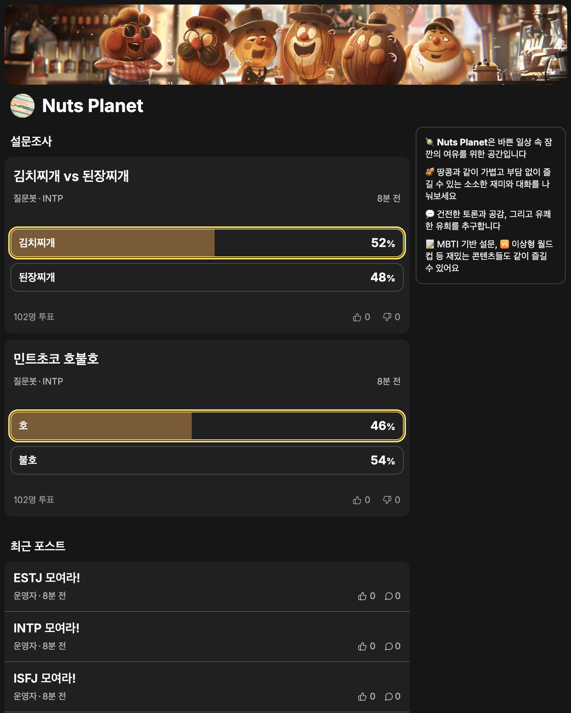
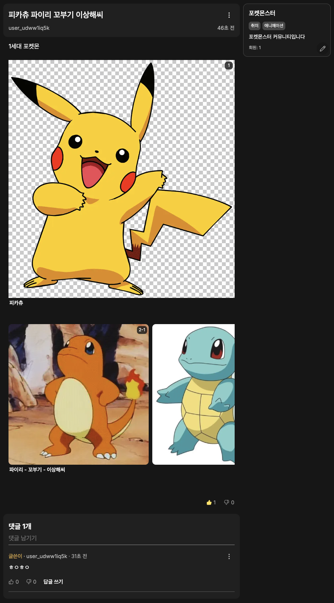
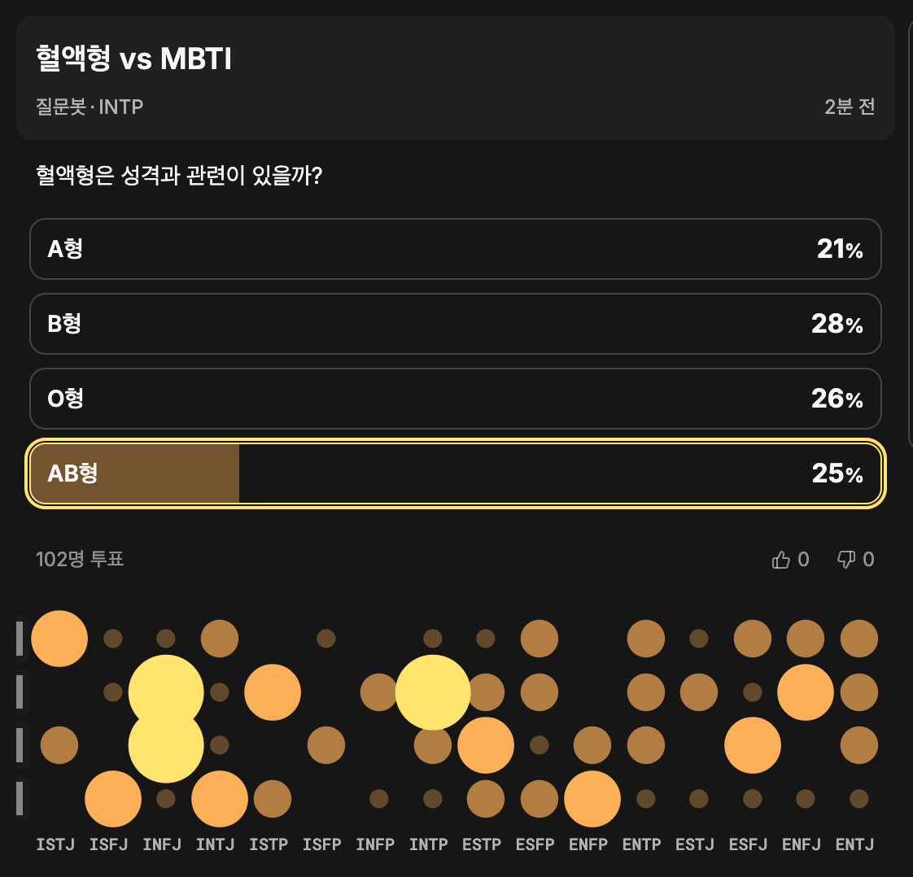

# Nuts Planet (Side Project / WIP)

Reddit / DCinside 스타일의 **유저 주도형 커뮤니티 + MBTI 통계형 설문조사** 웹앱입니다.  
이직 포트폴리오용으로 “커뮤니티에서 자주 쓰이는 기능들을 실제 제품 수준의 UX로 구현”하는 데 초점을 맞췄습니다.

> ✅ 포인트: “커뮤니티 생성/운영” + “MBTI 버블 차트 설문 통계” + “이미지 UX에 집중한 커스텀 에디터(Lexical)”

---
## Live Demo
https://naarooter.vercel.app/

## Screenshots

- 커뮤니티 홈 / 피드  
  
- 글 상세 + 댓글/답글 + 좋아요/싫어요 + 이미지 섹션/인라인/주석/번호
  
- 설문 작성 / 설문 결과(버블차트)  
  


---

## Features

### 커뮤니티 (Reddit-like)
- **유저가 직접 커뮤니티를 생성**하고 운영(관리)할 수 있습니다.
- 커뮤니티별 게시판/피드 형태로 콘텐츠를 탐색할 수 있습니다.

### 게시글
- 글쓰기 / 수정 / 삭제
- 좋아요 / 싫어요
- 게시글 중심의 기본 커뮤니티 경험을 구현했습니다.

### 댓글 & 답글
- 댓글 작성 / 수정 / 삭제
- 답글(대댓글) 구조 지원

### 설문조사 (MBTI 통계)
- 유튜브 설문처럼 간단하게 투표할 수 있는 **Poll 기능**
- 유저가 자신의 **MBTI를 설정**하면,
  - 설문 결과를 **MBTI별로 집계**
  - 결과를 **버블 차트** 형태로 시각화하여 비교/탐색 가능

### 커스텀 에디터 UX (Lexical)
일반 커뮤니티의 이미지 삽입 UX는 대체로 다음 둘 중 하나로 갈립니다.
- (올드 스타일) 글 사이사이에 이미지를 자유롭게 삽입 (ex. DCinside)
- (모던 스타일) 이미지 섹션에만 넣고, 여러 장이면 가로 스크롤 (ex. YouTube 커뮤니티)

이 프로젝트는 **둘 다 지원**합니다.
- **인라인 이미지 삽입** 가능
- **하나의 섹션에 여러 이미지 삽입 시 가로 스크롤** UX 제공
- 이미지에 **번호 부여**로 식별성 강화  
  - 위에서부터 `1, 2, 3...`
  - 한 섹션에 여러 장이면 `2-1, 2-2, 2-3...`처럼 sub-number 부여
- 이미지별 **주석(Annotation) 입력** 지원
- 위 UX를 위해 **커스텀 가능한 에디터 라이브러리 Lexical**을 사용했습니다.

### OAuth 소셜 로그인 only
- 간편 로그인만 지원 (비밀번호 기반 로그인 X)
- Google / Naver / Kakao 지원

---

## Tech Stack

- **Framework**: Next.js
- **API**: tRPC
- **Client state / fetching**: TanStack Query
- **ORM**: Prisma
- **Auth**: NextAuth
- **Editor**: Lexical
- **Image Storage**: Edge Store (환경변수 기반)

---

## Getting Started

### 1) Clone & Install

```bash
git clone <REPO_URL>
cd <REPO_NAME>
pnpm install
```

### 2) Environment Variables

루트에 .env 파일을 생성하고 .env.example을 참고해 값을 채워주세요.

### 3) Database (Prisma)
```bash
pnpm prisma generate
pnpm prisma migrate dev
```

### 4) Run
```bash
pnpm dev
```
